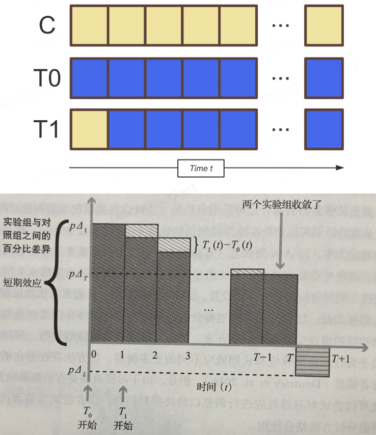

# Google顶会论文分享(附源码)--在个性化推荐系统中评估用户习得效应

## 论文介绍：
[Causal Estimation of User Learning in Personalized Systems∗](https://arxiv.org/pdf/2306.00485.pdf) 《在个性化推荐系统中评估用户习得效应》这篇论文是 Google 2023年6月2号发表在[EC23](https://ec23.sigecom.org/program/virtual-schedule/) (ACM Conference on Economics and Computation)A类会议中的一篇文章。[复现代码](https://github.com/huangchaodian/ccd-freeze) [算法复现体验](https://huangchaodian.github.io/ccd-freeze/)

## 主要贡献：
实验长短期的差异除了受**用户习得效应**影响外，还受到推荐系统**个性化推荐效果**的影响。CCD实验(2015)在个性化推荐情况下评估用户习得效应存在偏差。
文章提出三种实验模型(CCD-switch、CCD-freeze、CCD-cluster)来将**用户习得效应**从个性化推荐效果影响中剥离出来单独评估。通过指数分布拟合可以基于中期实验来预估长期实验效果。并且通过模拟仿真证明了方法的有效性。
## 背景介绍
做长期有价值的事。如何判断一个事情是否有长期价值？如何评估一个事情的长期价值呢？这是一个值得大家深思的问题。

在设计实验时，通常我们会关注两个目标：
1. 通过少量用户，预估实验推广到全量用户的效果。--（空间上的推广）
2. 通过短、中期实验，预估实验推广到很长时间后的效果及长期效应。--（时间上的推广）

大家更关注推全后的影响，对于时间上的推广关注相对较少，然而实验的**长期效应**有时价值更高。

## 什么是长期效应
通常情况下，我们建议运行实验**一到两周**，在如此短的时间测得的实验效应称为**短期效应**，大多数实验的短期效应能够推广到我们在乎的长期效应。但在有些情况下，长期效应与短期效应不同。短期内实验效果的提升并不一定意味着长期效果的提升。**长期效应**被定义为实验的渐近效应，从理论上讲，他可以持续数年。实际上，通常将长期考虑为**3个月以上**，或者基于曝光次数(使用新功能至少10次的用户的实验效应)

## 长期效应和短期效应不同的原因
### 用户习得效应(User Learning)
随着用户学习并适应变化，他们的行为也会发生变化：
1. 一项新功能需要一段时间才能被用户注意到，但是一旦发现它有用，就会频繁使用。
2. 用户可能会对首次发布的新改动投入更多的探索
3. 用户可能会需要时间适应新功能
4. 一次产品崩溃可能不会使用户放弃，频繁崩溃用户可能会放弃使用产品

### 网络效应
用户行为往往会受到其网络中其他人的影响，网络传播可能需要一段时间才能完全发挥作用，如收藏评论分享等。对于双边市场，有限的资源会带来更多挑战，如供应不足对营收的影响可能需要更长的时间才被发现。

### 延迟的体验和评估
用户可能会需要一段时间来体验到整个实验改动。如发优惠券到核销可能会要很长一段时间。

### 系统的变化
1. 季节性：如气温的变化可能会影响用户的购买意向
2. 竞争格局：对手启动了相同的功能
3. 政府政策：数据保护条例改变了用户行为的获取方式
4. 软件性能下降：代码中的假设随时间而变得不成立
5. 行为历史的累积：个性化推荐需要积累足够多的用户行为数据才能有较好的表现

## 为什么要测量长期效应
1. **归因**：对实验的长期效应进行正确的测量和归因，有助于跟踪团队的目标和绩效以及长期财务预测。引入新功能，从长远来看，产品的效果将会是怎样的。
2. **洞察**：了解实验长期效应和短期效应的不同，可以为后续的跌倒和改进提供洞察。例如如果发现用户花费太长时间才能发现自己喜欢的新功能，则可以添加用户教育来加快领会速度。
3. **可推广性**：如实验短期效果较好，但是长期效应较差。不了解长期效应的情况下贸然推全，可能会导致实验结果反转并伤害到用户。

## 方法回顾
### 长期运行的实验
测量长期效应的最简单方法是长期运行实验，可以在实验开始时（第一周pΔ1）和实验结束时（第一周pΔT）测量实验效应。其中pΔT代表实验的长期效应。

存在的问题：
1. 长期运行实验不仅存在成本问题，同时也会引入实验效应泄漏、幸存者偏差等新的问题。
2. 不能将pΔ1和pΔT之间的差异解释为实验本身引起的有意义的差异。由于时间混杂的存在，我们无法直接比较短期和长期的实验效应。有时混杂带来的波动性将覆盖收敛趋势。

假设：实验的效果 = 静态效果+ 动态效果。该方法无法单独评估动态效果，因此很难通过短中期实验来预估实验的长期效果。

### Post AA
在实验运行一段时间后，关闭或者开启实验，然后对比实验组和对照组之间的差异。这时，实验组和对照组产品功能体验完全相同。若他们之间存在差异，这证明实验存在动态效果，给定足够多的该类型实验，系统还可以重新的短期实验中外推出预期的长期效应（Gupta et al. 2019）。若他们之前不存在差异，则可以合理外推实验的短期效果和长期效果基本一致。

存在的问题：
1. 该方法仅能在实验结束时判断长期效应。在实验过程中无法获取初步结果。
2. 需要运行多长时间才能评估出长期效应可能无法提前知道。

### 时间交错式实验
在开始时间错开的情况下运行同一实验的两个版本。一个版本在t=0开始，另一个版本在t=1开始，然后测量两个版本之间的差异。

存在的问题：用户长期效应可能需要一段时间才能显现出来，两个紧挨着的实验组可能无法捕获到这些差异。

### CCD（Cookie-Cookie-Day）
该实验共包含 3 个实验组，分别为长期实验组(CT)、对照实验组(CC)和 CCD 实验组(CDTt)。其中，长期组在实验期间始终受策略影响，积累学习效应，对照组是没有策略作用，CCD 实验组是将该组用户随机划分成若干份，每天抽取一份使其当天受到策略影响而其余时间不受策略影响。

通过比较第 d 天 CCD 组和长期组，可以“抹去”策略带来的短期效果，于是两组的差异则来自于长期动态效果，从而产生描述动态效应的时间序列，达到评估长期效果的目的。

存在的问题：
1. 需要一个很大Cookie-Day池子用来提供流量。
2. 增加了基础设施的复杂性。

## 本文方法介绍
在仅仅考虑个性化推荐和用户习得效应的情况下，构建如下因果图，i代表用户，t代表时间，X代表用户行为（比如说点击），S 代表用户观测到的系统状态（比如说网页的展示），W 代表用户是否有策略影响，U 代表用户行为偏好（无法观察），Y 是最终效果，可以看到当前的行为既受到当前用户行为偏好的影响，也受到当前系统状态的影响，而系统状态则受到策略和过往行为的影响。

在此情况下，策略的总体效应是由短期效应 、用户习得效应和个性化推荐效应三方面共同决定的。

一般来说，在 CCD 实验中，个性化的影响与用户习得效应的影响相结合，忽略个性化影响会产生对用户习得效应的有偏估计。如果偏向于积极的用户习得效应，那么平台可能会推出一个实际上伤害了用户的功能。另一方面，如果偏向于消极学习，那么一个真正有益的功能可能无法推出。

另外单独评估习得效应对于实验本身很重要：
1. 用户习得效应效果的收敛速度比个性化推荐慢。
2. 用户习得效应是质量的良好代理度量(Sadeghi et al.2022)。

一个自然的解决方案是在测量用户习得效应时去除个性化。而不是根据用户的观看历史进行个性化推荐，系统可以向每个用户推荐相同的一组电影。对于 CT 和 CDTt 用户的建议是相同的，消除了因个性化而产生的偏见。 不幸的是，在许多设置中，删除个性化是不可取的，因为它会显著降低用户体验的质量。相反， 文章提出的实验设计，能够在个性化存在的情况下衡量用户习得效应。

### CCD-Switch
受到CCD新增Cookie-Day分组启发。CCD-Switch 方法增加了一个实验组，该实验组接受长期策略的影响，但被系统推荐时，该组用户接收到的内容会被替换成对照组中“相似用户”接收到的内容，保证该组用户的推荐不受其历史行为的影响。在此设定下，就可以通过对比四个实验组的结果来得到总体效应的三个部分，从而推断出策略的长期效应。

长期效果：CT-CC

个性化推荐效应：CT-CS

用户习得效应：CS-CDT

短期效果：CDT-CC

偏差：

### CCD-Freeze
一个不同的建议是使用处理用户的实验前个性化状态作为个性化状态的代理，称之为CCD-Freeze的设计。增加了一个实验组(CF)，他们接受治疗，但根据他们固定的实验前用户操作历史接受系统个性化

长期效果：CT-CC

个性化推荐效应：CT-CF

用户习得效应：CF-CDT

短期效果：CDT-CC

### Clustered-CCD
将用户聚类到K个大小相等的簇中，在整个实验过程中固定不变，修改推荐算法，使得推荐基于集群的历史，而不是单个用户进行个性化推荐。剩下的步骤和标准CCD一致。

长期效果：CT-CC

个性化推荐效应：无

用户习得效应：CT-CDT

短期效果：CDT-CC

该方法要求满足可加性可分离性假设：即用户习得效应和个性化效果是相加可分离的。

## 仿真验证
假设流媒体电影服务，通过使用特殊标记突出获奖电影来提升高用户观看率。随着时间的推移，用户被更多的推荐获奖电影， 导致整体观看率的逐步增加。

模拟有 4000 个用户，有两类电影:获奖电影(aw)和标准电影(s)。根据以下分布对用户偏好进行采样，该分布显示了4个均匀大小的集群的自然聚类结构。

其中聚类中心(Uc)在满足均匀分布，用户对两种类型电影的偏好(Ui,m)满足贝塔分布。对聚类中心抽样后整体调整使得所有用户对两类电影的平均观看率都为0.25。

在模拟过程中分50个时间段，每个时间段向每个用户推荐一部电影(m)。当用户被推荐一部电影时，他们会以某种固定的概率(Pi,t)观看(或不看)这部电影，这取决于电影的类别、用户的个人偏好，以及这部电影是否被标记。标记的直接效果是，将用户观看获奖电影(aw)的概率增加0.5。由于标准电影(S)不能接收任何标记，用户观看标准电影的概率不会发生变化。

为简单起见，这里也没有用户习得效应。对于推荐系统，选择具有β(1,1)先验的汤普森采样(1933)作为推荐系统。

随着时间的推移，所有方法(除了没有个性化的 CCD)的结果都会有所改善。Cluster-CCD的提升速度非常快，因为用户偏好是自然聚类的，每个用户的行为在每个时间段内都被记录在整个集群中。与 CCD 实验相比，CCD-Freeze和 CCD-Switch的观察速率随时间的提高速度较慢。CF 和 CS 组即使接受治疗，也会根据对照组个性化状态收到推荐，这意味着这些组被推荐的标准电影比他们应该推荐的次数要多，从而降低了平均观看率。

除了Cluster-CCD 外，所有方法都能恢复正确的直接效应值。Cluster-CCD方法产生偏差的原因是，在该模拟中，处理的性质打破了可加性可分离性假设。具体来说，该仿真违反了个性化推荐和直接效果的可分离性:当用户看到的大多是获奖电影时，直接效果更高， 而当用户看到的大多是非获奖电影时，直接效果更低。这导致了对直接效应的高估，因为在每个集群内，所有用户都会看到更多的获奖电影。因为集群中的一些用户受到了处理，并且所有用户都具有相同的用户特征。

最后， CCD-Switch 和 CCD-Freeze 对于个性化效果的估计都收敛于渐近值。随着系统学习每个用户的偏好，个性化效果会随着时间的推移而增加，最终随着系统对用户行为的估计收敛于用户的真实行为而趋于稳定。

## 结论和展望
通过复杂的实验设计，我们是有办法将用户习得效应和个性化算法效果分离出来单独评估的。在未来的工作中，当收集更长时间的数据对平台来说代价高昂时，如何估算实验的最佳长度来估算出用户学习效应将是一个很有趣的课题。

